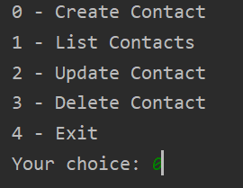

# Simple Contacts Manager
This is a command line tool to manage your contacts.

# Usage
After starting the application, the menu should guide you through.

# Screenshot

# What I've learned
- Using the State Design Pattern
- Managing Data in a database with JDBC
- Implementing CRUD operations
